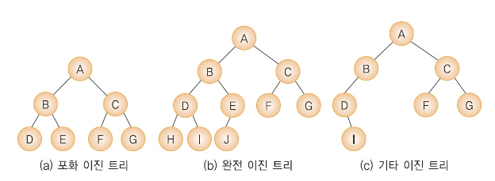
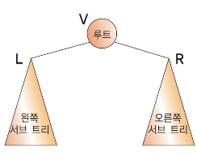

# 자료구조 정리

- [Stack & Queue](#stack--queue)
- [Tree](#tree)
- [Heap](#heap)
- [Array](#array)
- [ArrayList](#arraylist)
- [LinkedList](#linkedlist)
- [HashTable & HashMap](#hashtable--hashmap)
- [우선순위 큐 (Priority Queue)](#우선순위-큐-priority-queue)
- [Stack & Queue 구현](#stack--queue-구현)
- [Binary Tree & Binary Search Tree](#binary-tree--binary-search-tree)
- [Red-Black-Tree](#red-black-tree)

---

## Stack & Queue

### Stack

`후입 선출 (LIFO _ Last In First Out)`

> 가장 나중에 들어간 데이터가 가장 먼저 나오는 구조

- push: 데이터 삽입
- pop: 데이터 추출
- top: 맨 위 데이터 조회

### Queue

`선입 선출 (FIFO _ First In First Out)`

> 가장 먼저 들어간 데이터가 가장 먼저 나오는 구조로, 데이터의 삽입은 뒤쪽에서, 추출은 앞쪽에서 이루어집니다.

- enqueue: 데이터 삽입
- dequeue: 데이터 추출

### Stack과 Queue는 어디에 사용하는가?

1. Stack

   - 인터럽트 처리
     > 인터럽트가 발생하면 현재 실행 중인 작업의 상태를 스택에 저장하고 인터럽트 처리 루틴을 실행한다.
   - 함수호출
     > 프로그램에서 함수를 호출할 때, 함수의 실행 정보(지역 변수, 반환 주소 등)는 스택에 저장된다. 이를 통해서 함수가 종료되면 이전 함수로 제어가 돌아가는 등의 작업이 가능해진다.
   - 웹 브라우저의 뒤오 가기 기능
     > 사용자가 방문한 페이지를 스택에 저장하여, 뒤로 가기 버튼을 클릭하면 이전 페이지로 이동할 수 있게 한다.

2. Queue

   - 프린터의 작업 대기열
     > 여러 문서가 프린터에 인쇄 요청을 할 때, 큐를 사용하여 요청된 순서대로 인쇄 작업을 관리한다.
   - 멀티태스킹 (운영 체제 스케줄러)
     > 운영체제에서 프로세스 스케줄링을 위해 큐를 사용한다. 여러 프로세스가 실행되기를 기다릴 때, 이들을 큐에 넣어 순서대로 처리한다.
   - 실시간 시스템에서의 데이터 처리 (I/O 요청 큐)
     > 네트워크 트래픽 관리, 이벤트 기반 시스템 등에서 데이터를 순차적으로 처리하는 데 큐가 사용된다.

---

## Tree

`비선형 자료구조`

> 트리는 계층적 관계를 나타내는 비선형 자료구조이다. 하나의 루트 노드를 가지고, 그 루트 노드에서부터 여러 개의 자식 노드가 분기되며, 이러한 구조가 반복되어 나무와 같은 형태를 이룹니다. 각 노드는 한 개의 부모 노드와 여러 개의 자식 노드를 가질 수 있으며, 특히 이진 트리(Binary Tree)는 각 노드가 최대 두 개의 자식 노드를 가질 수 있습니다.

---

## Heap

`최댓값 또는 최솟값을 찾아내는 연산을 쉽게 하기 위한 구조`

> 힙은 완전 이진 트리를 기반으로 하는 자료구조로, 특히 우선순위 큐를 구현하는 데에 사용한다(빠른 접근 제공). 힙에는 두가지 종류가 있다.

- 최대 힙: 부모 노드가 자식 노드보다 항상 크거나 같다.
- 최소 힙: 부모 노드가 자식 노드보다 항상 작거나 같다.

### 최대 힙에서의 삽입

1. 삽입 위치 찾기: 새로운 요소는 힙의 가장 마지막에 위치한다. 이는 완전 이진 트리의 성질을 유지하기 위해서 이다.
2. 힙 재정렬: 삽인된 요소가 부모 노드보다 크면, 부모 노드와 교환한다. 이 과정을 새로운 요소가 부모 노드보다 작거나 루트 노드에 도달할 때 까지 반복합니다.

### 최대 힙에서의 삭제

1. 삭제할 요소 제거: 힙에서 삭제는 일반적으로 루트노드를 제거하는 것을 의미한다.
2. 마지막 요소 이동: 힙의 마지막 요소를 루트로 이동한다.
3. 힙 재정렬: 이동된 요소가 자식 노드들보다 작으면, 더 큰 자식 노드와 교환합니다. 이 과정을 자식 노드들 보다 크거나 리프 노드에 도달할 때까지 반복한다.

---

## Array

> 배열은 동일한 유형의 여러 데이터 요소들이 연속적인 메모리(`순차적`) 위치에 저장되는 구조이다. 각 요소는 인덱스를 통해 접근할 수 있으며, 이 인덱스는 배열의 시작부터 얼마나 떨어져 있는지를 나타낸다.

### 배열의 특징

- `연속적인 메모리 할당`
  > 배열의 모든 요소는 메모리 상에서 연속적으로 위치한다.
- `인덱스 기반 접근`
  > 배열의 각 요소는 인덱스를 통해 빠르게 접근할 수 있습니다.

### 배열의 장점

1. `빠른 접근 속도`
   > 인덱스를 이용한 직접 접근(direct access)으로 인해, 특정 요소에 매우 빠르게 접근할 수 있습니다.
2. 메모리 효율성
   > 연속적인 메모리 할당으로 인해 메모리 관리가 용이하며, 오버헤드가 적습니다.

### 배열의 단점

1. `삽입 및 삭제의 비효율성`
   > 배열 중간에 요소를 삽입하거나 삭제하는 과정이 비효율적입니다. 특히, 중간에 요소를 삽입하거나 삭제하는 과정이 비효율적입니다. 특히 중간에 요소를 삽입하거나 삭제할 때 다른 요소들을 이동시켜야 하므로 시간이 많이 소요됩니다.
2. 메모리 낭비 가능성
   > 선언된 크기보다 적은 요소를 사용할 경우, 남는 메모리 공간이 낭비될 수 있습니다.

---

## ArrayList

> `동적 배열을 구현한 자료구조`입니다. 배열과 마찬가지로 인덱스를 통해 각 요소에 접근할 수 있지만, 크기가 동적으로 변화할 수 있는 특징을 가지고 있습니다.

### Array와 ArrayList의 차이점

1. 크기 변화 가능성

   - Array
     > `크기가 고정` 되어 있어 배열을 선언할 때 크기를 지정하며, 이후에는 크기를 변경할 수 없습니다.
   - ArrayList
     > `크기가 동적`으로 변합니다. 필요에 따라 자동으로 크기가 늘어나거나 줄어들 수 있습니다.

2. 성능

   - Array

     > 배열은 크기가 고정되어 있고 메모리에 연속적으로 할당되기 때문에 인덱스를 통한 데이터 접근이 매우 빠릅니다.

   - ArrayList
     > 동적으로 크기가 변하는 특성 때문에, 삽입, 삭제 등의 작업이 배열에 비해 상대적으로 느릴 수 있습니다. 특히, 크기가 변경될 때 내부적으로 새로운 배열을 생성하고 데이터를 복사해야 하므로 오버헤드가 발생할 수 있습니다.ㄴ

---

## LinkedList

> `데이터 요소들이 노드 형태로 이루어진 자료구조`이다. 각 노드는 데이터와 다음 노드를 가리키는 참조(또는 포인터)를 가지고 있습니다. 이러한 구조 덕분에 노드들이 메모리 상에서 연속적으로 위치할 필요가 없습니다.

### LinkedList와 Array의 비교

1. 메모리 할당
   - Array
     > `메모리가 연속적으로 할당됩니다.` 고정된 크기를 가지며, 크기를 변경하기 위해서는 새로운 배열을 만들고 데이터를 복사해야 합니다.
   - LinkedList
     > `노드는 어디에든 메모리가 할당될 수 있으며`, 포인터를 통해 서로 연결됩니다. 따라서 메모리를 효율적으로 사용할 수 있습니다.
2. 데이터 접근
   - Array
     > 인덱스를 통한 접근이 가능하여, 데이터 접근 속도가 매우 빠릅니다.
   - LinkedList
     > 특정 요소에 접근하기 위해서는 첫 번째 노드부터 시작하여 해당 노드에 도달할 때 까지 순차적으로 탐색해야 합니다. 따라서 접근 속도가 상대적으로 느립니다.
3. 삽입 및 삭제
   - Array
     > 중간에 요소를 삽입하거나 삭제할 때, 다른 요소들을 이동시켜야 하므로 비효율적일 수 있습니다.
   - LinkedList
     > 삽입과 삭제가 효율적입니다. 특정 위치의 노드를 추가하거나 제거할 때, 해당 노드의 참조만 변경하면 되기 때문에 빠른 연산이 가능합니다.
4. 메모리 오버헤드
   - Array
     > 데이터의 크기가 고정되어 있거나, 인덱스를 통한 빠른 접근이 필요한 경우에 적합합니다.
   - LinkedList
     > 데이터의 크기가 자주 변하거나, 삽입과 삭제가 빈번히 일어나는 경우에 적합합니다.ㄴ
5. 용도
   - Array
     > 데이터의 크기가 고정되어 있거나, 인덱스를 통한 빠른 접근이 필요한 경우에 적합합니다.
   - LinkedList
     > 데이터의 크기가 자주 변하거나, 삽입과 삭제가 빈번히 일어나는 경우에 적합합니다.

---

## HashTable & HashMap

> HashTable과 HashMap은 키를 값에 매핑하는 데 사용되는 자료구조로, 빠른 데이터 검색을 위해 사용됩니다. 두 구조는 비슷한 기능을 하지만, 몇 가지 차이점이 있다.

### HashTable

> 해시테이블은 키-값 쌍을 저장하기 위해 해시 테이블을 사용하는 자료구조입니다. 각 키는 해시함수를 통해 해시코드로 변환되며, 이 해시코드는 값을 저장하거나 검색할 위치를 결정하는 데 사용됩니다.

- 동기화: HashTable은 동기화 됩니다. 즉, 멀티스레드 환경에서 안전하게 사용할 수 있지만, 이로 인해 단일 스레드 환경에서는 성능이 저하될 수 있습니ㅏㄷ.
- 키와 값: HashTable은 null키나 null값을 허용하지 않습니다.

### HashMap

> 해시맵은 해시테이블을 기반으로 하는 자료구조이며, 해시테이블과 유사하게 키-값 쌍을 저장합니다.

- 동기화: 해시맵은 해시테이블과 달리 동기화되지 않습니다. 따라서 멀티 스레드 환경에서는 추가적인 동기화 조치가 필요하지만, 단일 스레드 환경에서는 더 빠른 성능을 제공합니다.

- 키와 값: 해시맵은 하나의 null키와 여러 개의 null 값을 허용합니다.

### HashTable 과 HashMap의 차이점

- 동기화 여부: 'HashTable'은 'null'을 허용하지 않지만, 'HashMap'은 'null'키와 값 모두를 허용합니다.
- 성능: 동기화로 인해 'HashTable'은 'HashMap'보다 느릴 수 있습니다.

---

## 우선순위 큐 (Priority Queue)

> 우선 순위 큐는 특정한 우선 순위를 가진 요소들을 처리하기 위해 사용되는 자료구조 입니다. 일반적인 큐와는 다르게, 우선 순위 큐에서는 요소들이 우선 순위에 따라 순서가 결정됩니다. 이 자료구조는 다양한 응용프로그램에서 효율적인 요소 관리를 위해 사용됩니다.

### 우선 순위 큐의 특징

- 우선 순위 정렬
  > 큐에 추가되는 각 요소는 특정한 우선 순위를 가집니다. 이 우선 순위는 요소가 큐에서 처리되는 순서를 결정합니다.
- 동적 정렬
  > 새로운 요소가 추가될 때마다, 우선 순위에 따라 자동으로 재정렬됩니다. 따라서 항상 우선 순위가 가장 높은 요소가 큐의 맨 앞에 위치합니다.
- 다양한 구현 방법
  > 우선 순위 큐는 배열, 연결 리스트, 힙등 다양한 방법으로 구현될 수 있습니다. 그중 힙은 우선 순위 큐를 구현하는 데 가장 효율적인 자료구조 중 하나입니다.

### 우선 순위 큐의 응용

- 데이터 처리
  > 데이터를 우선 순위에 따라 처리해야 하는 경우(네트워크 트래픽 관리, 운영체제의 작업 스케줄링)에 사용된다.
- 알고리즘 구현
  > 다익스트라 알고리즘과 같은 그래프 알고리즘에서 최소 비용 경로를 찾기 위해 사용됩니다.
- 실시간 시스템
  > 항공편 예약 시스템 등 실시간으로 우선 순위가 높은 작업을 처리해야 하는 시스템에서 활용됩니다.

---

## Stack & Queue 구현

- Stack

```cpp
#include <iostream>
#include <vector>

class Stack {
private:
    std::vector<int> stack;

public:
    void push(int value) {
        stack.push_back(value);
    }

    void pop() {
        if (!stack.empty()) {
            stack.pop_back();
        } else {
            std::cout << "스택이 비어있습니다." << std::endl;
        }
    }

    int top() {
        if (!stack.empty()) {
            return stack.back();
        } else {
            std::cout << "스택이 비어있습니다." << std::endl;
            return -1;  // 스택이 비어있을 때의 예외 처리
        }
    }

    bool isEmpty() {
        return stack.empty();
    }
};

```

- Queue

```cpp
#include <iostream>
#include <list>

class Queue {
private:
    std::list<int> queue;

public:
    void enqueue(int value) {
        queue.push_back(value);
    }

    void dequeue() {
        if (!queue.empty()) {
            queue.pop_front();
        } else {
            std::cout << "큐가 비어있습니다." << std::endl;
        }
    }

    int front() {
        if (!queue.empty()) {
            return queue.front();
        } else {
            std::cout << "큐가 비어있습니다." << std::endl;
            return -1;  // 큐가 비어있을 때의 예외 처리
        }
    }

    bool isEmpty() {
        return queue.empty();
    }
};

```

---

# Algorithm

## Binary Tree & Binary Search Tree

### Binary Tree

> 바이너리 트리는 각 노드가 최대 두 개의 자식 노드를 가질 수 있는 트리구조의 자료구조입니다. 이 두 자식은 일반적으로 '왼쪽 자식'과 '오른쪽 자식'으로 구분된다.

1. 정의
   > 각 노드가 최대 두개의 자식을 가지며, 자식은 왼쪽과 오른쪽으로 구분된다.
2. 사용 예
   > 다양한 응용 프로그램에서 사용되며, 특히 계층적 데이터 구조를 표현하는 데 적합합니다.
3. 유형

   > 균형 잡힌 이진 트리, 완전 이진 트리, 포화 이진 트리등 다양한 유형이 있다.



### 순회



- 전위 순회: V-L-R
- 중위 순회: L-V-R
- 후위 순회: L-R-V

### BST

> 이진탐색과 연결리스트를 결합한 자료 구조이다. 이진탐색의 효율적인 탐색 능력을 유지하면서도 빈번한 자료 입력과 삭제가 가능하다는 장점을 가지고 있는 구조이다.
> `이진 탐색 트리는 왼쪽 트리는 부모 노드보다 작고, 오른쪽 트리는 부모 노드보다 값이 크다는 특징을 가지고 있다.`

---

## Red-Black-Tree

> 자가 균형을 맞추는 이진 탐색 트리의 일종으로, 삽입, 삭제, 검색등의 동작을 효율적으로 수행할 수 있도록 설계된 자료구조이다.

1. 장점
   > 'red-black-tree'는 연산 후에도 균형이 잘 잡힌 트리 구조를 유지한다. 이로 인해 최악의 경우에도 탐색, 삽입, 삭제 연산이 `O(log n)`시간에 이루어 질 수 있다.
2. 응용
   - 연관 배열 구조
     > 맵이나 셋과 같은 연관 배열 구조를 구현하는 데 종종 사용된다.
   - 메모리 할당
     > 컴퓨터 시스템에서 메모리 할당 및 해제를 관리하는 데 사용될 수 있다.

---

[맨 위로](#자료구조-정리)

|

[처음으로](../README.md)
