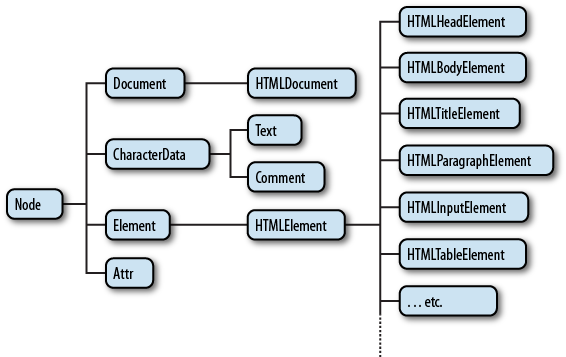

# DOM & BOM에 대해서

## DOM (Document Object Model)

> `웹 페이지를 프로그래밍적으로 제어할 수 있게 해주는 객체모델`


출처: https://ko.wikipedia.org/wiki/%EB%AC%B8%EC%84%9C_%EA%B0%9D%EC%B2%B4_%EB%AA%A8%EB%8D%B8

- DOM은 HTML 또는 XML 문서의 프로그래밍 인터페이스 입니다.
- `웹 페이지의 콘텐츠와 구조를 표현하는 계층적인 트리모델`로, 각 HTML 요소는 DOM 트리 내의 노드로 표현됩니다.
- DOM을 통해 자바스크립트와 CSS는 웹 페이지의 텍스트 콘텐츠, 구조 및 스타일을 동적으로 읽고 수정할 수 있습니다.

```javascript
const element = document.getElementById('example');
element.textContent = '새로운 내용';
```

## BOM (Browser Object Model)

> `브라우저의 창이나 프레임을 프로그래밍적으로 제어할 수 있게 해주는 객체 모델`


출처: https://web.stanford.edu/class/cs98si/slides/the-document-object-model.html

- BOM은 웹 브라우저의 창이나 프레임을 다루기 위한 객체 모델이다.
- BOM은 브라우저 창 및 탭, URL, 쿠키, 로컬스토리지, 세션 스토리지, 브라우저 내장 기능(navigator, screen, location, history 등)등을 다룹니다.
- BOM을 통해 자바스크립트는 브라우저와 상호작용하고, 새로운 창을 열거나, 사용자의 화면 크기를 감시하고, URL을 변경할 수 있습니다.
- BOM은 표준화가 잘 되어 있지 않아 브라우저마다 차이가 있을 수 있습니다.

```javascript
window.location.href = 'https://www.example.com';
```

<div style="weight: 100%; display: flex; justify-content: space-between;">

[< 처음으로 >](../README.md)

[< 다음 >](./rest.md)

</div>
