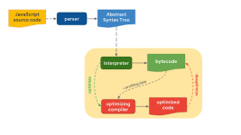

# 자바스크립트 엔진실행 과정

출처: https://mathiasbynens.be/notes/shapes-ics

- 소스코드를 만나면 파싱하여 AST(Abstract Syntax Tree)로 변환한다.
- 인터프리터는 AST를 기반으로 바이트 코드를 생성한다.
- 인터프리터가 바이트코드를 실행할 때, 자주 사용되는 함수 및 타입 정보 등이 있는 프로파일링 데이터와 같이 최적화 컴파일러에게 보낸다.
- 최적화 컴파일러는 프로파일링 데이터를 기반으로 최적화된 코드(Optimized code)를 생성한다.
- 만약, 프로파일링 데이터 중에 잘못된 부분이 있다면 최적화 해제(Deopimize)를 하고 다시 바이트 코드를 실행해서 이전 동작을 반복한다.

1. 파싱(Parsing)
   > 소스 코드를 읽고, 이를 구문 분석하여 AST로 변환
2. 컴파일(Compilation)
   > AST는 바이트코드로 변환된다.
3. 실행(Execution)
   > 컴파일된 바이트코드는 자바스크립트 엔진에 의해 실행된다.
4. 최적화(Optimization)
   > 불필요한 부분을 제거하고, 성능을 향상시키는 최적화가 이루어진다.
5. 가비지 컬렉션(Garbage Collection)
   > 필요 없어진 메모리를 자동으로 해제

[< 처음으로 >](../README.md)

[< 다음 >](./npm.md)

