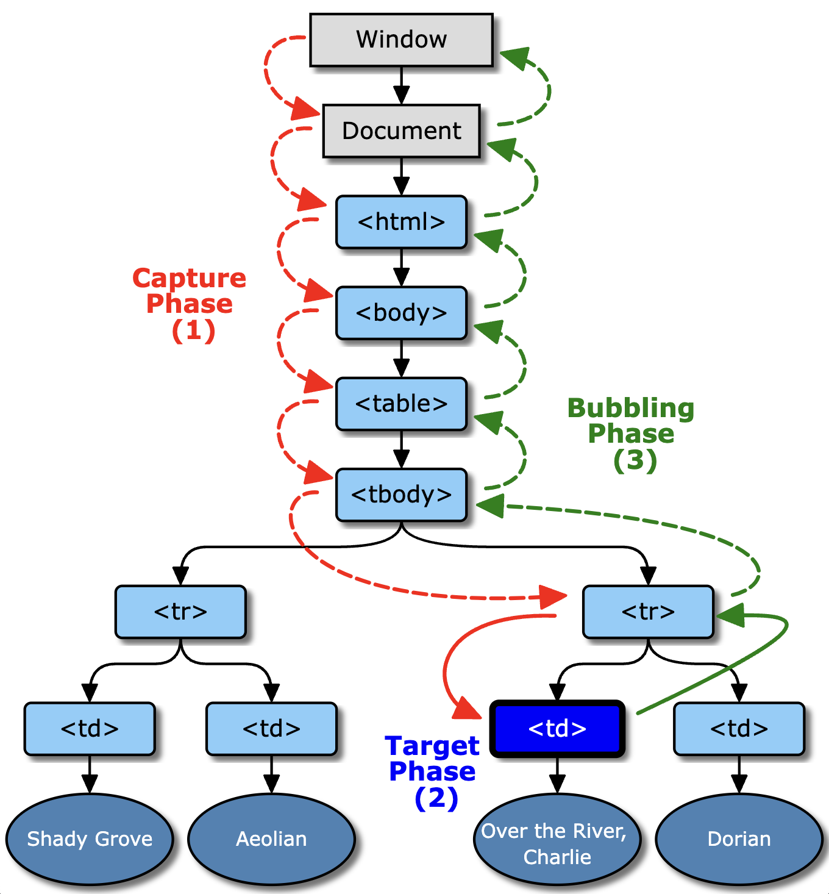

# Event Bubbling


출처: https://www.w3.org

## 이벤트 버블링과 캡쳐링 이란?

- `이벤트 버블링`은 이벤트가 `하위 요소에서 상위요소` 방향으로 전파 되는 것을 말한다.
- `이벤트 캡쳐링`이란 이벤트가 `상위 요소에서 하위요소` 방향으로 전파 되는 것을 말한다.
- 버블링 예시

```javascript
// HTML 구조
// <div id="parent">
//     <button id="child">클릭하세요</button>
// </div>

// 자바스크립트
document.getElementById('parent').addEventListener('click', function () {
  console.log('부모 요소 클릭!');
});

document.getElementById('child').addEventListener('click', function () {
  console.log('자식 요소 클릭!');
});
```

> 버블링이 일어나는 과정은 사용자가 'child'요소를 클릭하면 가장 먼저, 'child' 요소에 할당된 이벤트 리스너가 실행되며, 콜솔에 "자식 요소 클릭!"이 출력된다. 클릭이벤트는 'child'요소에서 발생한 후, 상위 요소인 'parent'로 버블링된다. 'parent'요소에도 클릭 이벤트 리스너가 있으므로, 이 리스너가 실행되며 콘솔레 "부모 요소 클릭!"이 출력 된다.

- 이벤트 제어
  > 기본 옵션은 버블링이다. 캡쳐링을 사용하고 싶다면 `true` 옵션을 주어 캡쳐링할 수 있다. `target.addEventListener("click", function(){}, true)`
- 이벤트 전파 방지
  > 이벤트 버블링을 방지하려면, 이벤트 객체의 `stopPropagation()` 메서드를 사용할 수 있다.

```javascript
document.getElementById('child').addEventListener('click', function (event) {
  console.log('자식 요소 클릭!');
  event.stopPropagation(); // 이벤트 버블링 방지
});
```

## 이벤트 버블링의 중요성

- `이벤트 위임`
  > 하나의 `부모요소에 이벤트 리스너를 설정`하여 `여러 자식 요소`들의 `이벤트를 처리`할 수 있다. 이를 이벤트 위임 이라 하며, 이는 `메모리 사용을 줄이고` `코드를 간결`하게 유지하는데 도움이 된다.

\+) 이벤트 위임: 이벤트 위임은 특정요소에 대해 동일한 이벤트 핸들러를 중복해서 설정하는 대신, 하나의 공통된 부모요소에 이벤트 핸들러를 설정하고, 발생한 이벤트가 어느자식 요소에 발생했는지를 식별하여 처리하는 방법이다.

- `이벤트 핸들링의 유연성`
  > `동적으로 생성되는 요소`들에 대한 이벤트 처리에 유용하다.

```javascript
// HTML 구조
<ul id="parent-list">
    <li>항목 1</li>
    <li>항목 2</li>
    <li>항목 3</li>
    <!-- 더 많은 리스트 항목들... -->
</ul>

// Javascript
document.getElementById('parent-list').addEventListener('click', function(event) {
    if (event.target.tagName === 'LI') {
        console.log(event.target.textContent + ' 클릭됨');
    }
});
```

<div style="weight: 100%; display: flex; justify-content: space-between;">

[< 처음으로 >](../README.md)

[< 다음 >](./this.md)

</div>
