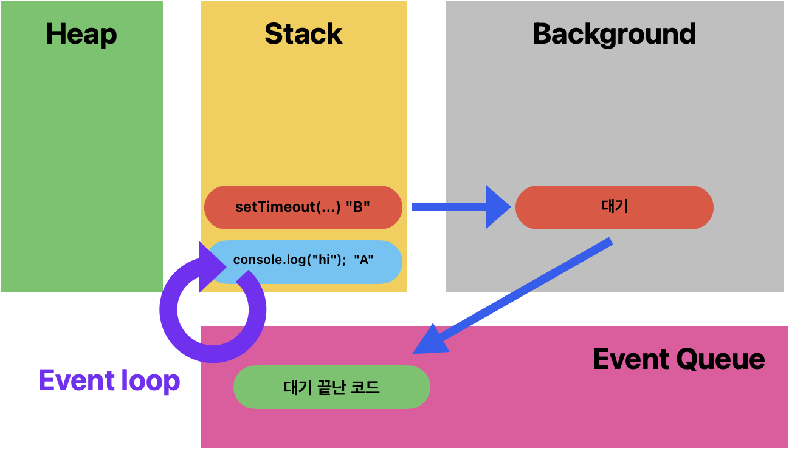

# Javascript의 브라우저 동작원리

> A 와 B가 실행 스택에 쌓인다. B는 비동기 이벤트으로 백그라운드로 이동하고 A는 바로 실행하여 "hi"를 출력한다. B는 setTimeout에 설정 된 시간 만큼 대기하고 대기가 끝나면 이벤트큐 로 이동하고 이벤트 루프를 통해 실행스택이 비어있음을 확인하고 해당 B를 실행스택에 올리고 실행한다.

---

- 실행스택

  > 코드가 실행될 때 호출되는 함수들의 스택이다. 자바스크립트는 단일 스레드 언어이기 때문에 한번에 하나의 작업만 처리할 수 있다.

- 이벤트 큐

  > 비동기적 이벤트 들이 대기하는 곳이다. (setTimeout, 사용자 이벤트, AJAX 요청 등)

- 이벤트 루프

  > 이벤트루프는 실행스택이 비어있는지, 그리고 이벤트 큐에 대기중인 작업이 있는지 확인한다. 실행스택이 비어있고 이벤트 큐에 작업이 있으면, 이벤트 루프는 큐에서 다음 작업을 가져와 실행스택에 넣는다.

  ⚙️ 추가

- 실행 컨텍스트란?  
  : 실행할 코드에 제공할 환경 정보들을 모아놓은 객체이다. 실행 컨텍스트로 코드의 환경과 순서를 보장할 수 있다.

- 콜 스택(Call Stack)  
  : 코드가 실행되면서 생성되는 실행 컨텍스트를 저장하는 자료구조이다. 또한 콜스텍에는 원시 타입의 값과 참조 타입의 메모리 힙 주소값이 저장되는 공간이다.

- 메모리 힙  
  : 원시 타입이 아닌 타입의 데이터가 저장되는 공간으로, 메모리 할당이 일어나게 된다.

[처음으로](../README.md)
